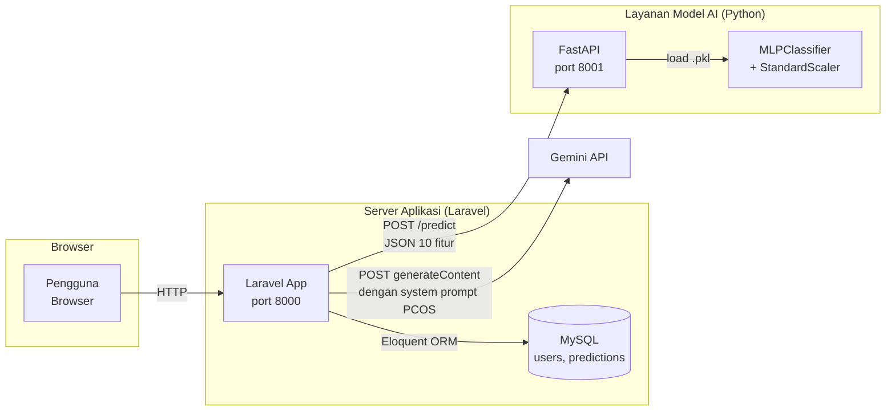
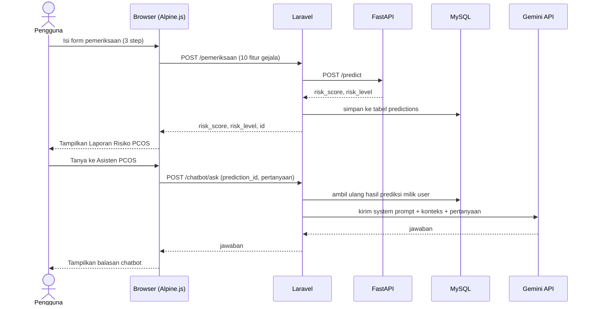
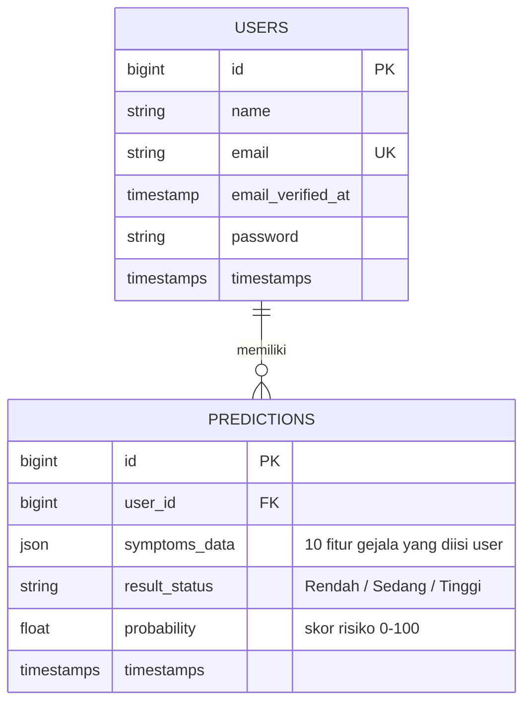

# Gambaran Sistem — PCOS Check

Dokumen ini menjelaskan gambaran umum sistem: latar belakang masalah, siapa penggunanya, bagaimana komponen-komponennya saling terhubung, dan bagaimana data mengalir dari satu bagian ke bagian lain. Untuk panduan instalasi & menjalankan aplikasi, lihat [README.md](../README.md).

## 1. Latar Belakang

PCOS (Polycystic Ovary Syndrome / Sindrom Ovarium Polikistik) adalah salah satu gangguan hormonal yang paling umum dialami wanita usia reproduktif — berbagai studi epidemiologi memperkirakan prevalensinya berkisar 8-13% tergantung populasi dan kriteria diagnosis yang dipakai. Meski umum, PCOS sering **terlambat terdiagnosis** karena beberapa alasan:

- **Gejala tumpang tindih** dengan kondisi lain (siklus haid tidak teratur, jerawat, kenaikan berat badan bisa disebabkan banyak hal selain PCOS), sehingga sulit dikenali sendiri oleh penderita.
- **Diagnosis formal** membutuhkan pemeriksaan klinis, tes hormon, dan USG panggul ke dokter Sp.OG — akses dan biaya pemeriksaan ini tidak selalu mudah dijangkau, terutama untuk skrining awal/mandiri.
- **Minimnya kesadaran & edukasi** membuat banyak wanita tidak menyadari gejala yang mereka alami berpotensi PCOS, sehingga tidak mencari penanganan lebih awal — padahal keterlambatan penanganan PCOS bisa berdampak pada masalah kesuburan, metabolik, dan risiko jangka panjang lainnya.

### Rumusan Masalah

1. Bagaimana membantu wanita melakukan **skrining risiko PCOS secara mandiri**, cepat, dan tanpa biaya, hanya berdasarkan gejala yang bisa mereka amati sendiri (tanpa tes lab)?
2. Bagaimana memanfaatkan **machine learning** untuk mengestimasi risiko PCOS dari data gejala tersebut secara akurat?
3. Bagaimana memberikan **edukasi lanjutan** yang relevan dan personal (sesuai hasil pemeriksaan masing-masing pengguna) tanpa harus langsung ke dokter untuk pertanyaan-pertanyaan dasar?

### Tujuan

- Membangun sistem web yang memungkinkan skrining risiko PCOS mandiri berbasis Jaringan Saraf Tiruan (JST), dari gejala yang mudah dijawab pengguna awam.
- Menyediakan riwayat & tren hasil pemeriksaan dari waktu ke waktu, supaya pengguna bisa memantau perubahan kondisinya.
- Menyediakan asisten chatbot AI sebagai kanal edukasi awal seputar PCOS, yang memahami konteks hasil pemeriksaan pengguna, sebagai pelengkap (bukan pengganti) konsultasi medis profesional.

## 2. Deskripsi Sistem

**PCOS Check** adalah aplikasi web untuk skrining dini risiko PCOS (Polycystic Ovary Syndrome) berbasis Jaringan Saraf Tiruan (JST). Pengguna mengisi data gejala sederhana (yang bisa dijawab tanpa tes lab), sistem menghitung estimasi skor risiko lewat model machine learning, lalu pengguna bisa berdiskusi lebih lanjut dengan asisten chatbot AI seputar hasil dan gejala PCOS.

### Aktor

| Aktor | Peran |
|---|---|
| **Pengguna (wanita)** | Registrasi, login, mengisi form pemeriksaan, melihat hasil & riwayat, bertanya ke chatbot |
| **Model AI (MLPClassifier)** | Menghitung skor risiko dari 10 fitur gejala |
| **Gemini API** | Menjawab pertanyaan seputar PCOS berdasarkan konteks hasil pemeriksaan pengguna |

## 3. Arsitektur Sistem

Sistem terdiri dari 3 layanan yang saling terhubung lewat HTTP, ditambah satu layanan pihak ketiga (Gemini):

**Kenapa lewat Laravel, bukan langsung ke FastAPI/Gemini dari browser?**
- **Keamanan**: API key Gemini dan alamat FastAPI tidak pernah terkirim ke browser pengguna.
- **Integritas data**: konteks yang dikirim ke chatbot (level risiko, skor, gejala) diambil ulang dari database berdasarkan `prediction_id` milik pengguna yang sedang login — bukan dipercaya begitu saja dari input klien, supaya tidak bisa dimanipulasi lewat DevTools.

## 4. Alur Penggunaan (User Flow)

Ringkasan tahapan:
1. **Registrasi/Login** — Laravel Breeze (rate limiting, session regenerate, password hashing).
2. **Isi form pemeriksaan** — 3 langkah: Data Diri (umur, berat, tinggi), Siklus Haid, Gejala Fisik & Gaya Hidup.
3. **Prediksi** — data dikirim ke FastAPI, dihitung BMI dari berat/tinggi, semua fitur di-scale lalu diprediksi model.
4. **Hasil ditampilkan** — skor risiko (0-100%), level (Rendah/Sedang/Tinggi), rekomendasi tindak lanjut, dan disimpan ke riwayat.
5. **Tanya Asisten PCOS** — chatbot yang tahu konteks hasil pemeriksaan pengguna, dibatasi hanya topik PCOS & kesehatan reproduksi wanita.
6. **Dashboard & Riwayat** — grafik tren skor risiko dari riwayat pemeriksaan asli pengguna.

## 5. Skema Basis Data (ERD)

## 6. Model AI

Ringkasan (detail lengkap ada di [README.md § Tentang Model AI](../README.md#tentang-model-ai)):

- Algoritma: `MLPClassifier` (scikit-learn), arsitektur `(128, 64, 32)`.
- 541 data klinis, 10 fitur, ditangani ketidakseimbangan kelas dengan SMOTE (hanya pada data training).
- Akurasi pada data uji (held-out, belum pernah dilihat model): **86.24%**.
- Notebook training: [`pcos_model_training.ipynb`](../pcos_model_training.ipynb).

## 7. Modul/Halaman Aplikasi

| Halaman | Route | Deskripsi |
|---|---|---|
| Login / Register | `/login`, `/register` | Autentikasi pengguna |
| Dashboard | `/dashboard` | Ringkasan, grafik tren risiko, riwayat terbaru |
| Pemeriksaan | `/pemeriksaan` | Form 3-step + hasil prediksi + chatbot |
| Riwayat | `/riwayat` | Semua riwayat pemeriksaan pengguna |
| Edukasi | `/edukasi` | Artikel edukasi PCOS & kesehatan reproduksi |
| Chatbot (API) | `POST /chatbot/ask` | Endpoint backend untuk tanya-jawab dengan Gemini |

## 8. Batasan Sistem

- Model memberikan **estimasi risiko**, bukan diagnosis medis pasti — selalu disertai anjuran konsultasi ke dokter Sp.OG untuk risiko sedang/tinggi.
- Chatbot dibatasi lewat system prompt hanya menjawab topik PCOS & kesehatan reproduksi wanita; di luar topik itu akan menolak dengan sopan dan mengarahkan kembali.
- Akurasi model (86.24%) berarti prediksi bisa meleset di sebagian kecil kasus — lihat rincian precision/recall di README.
